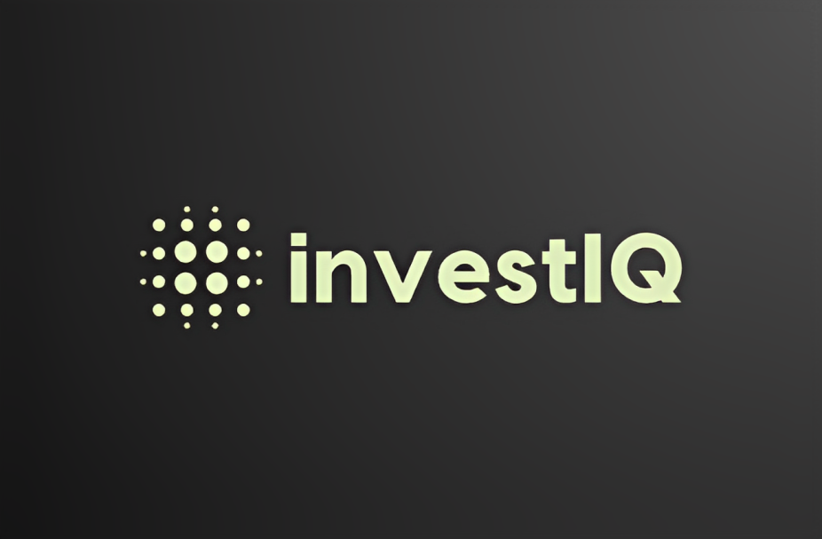
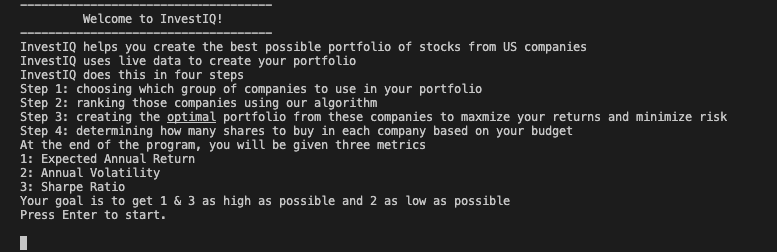
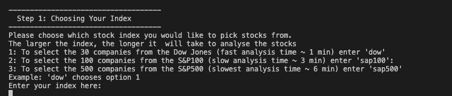
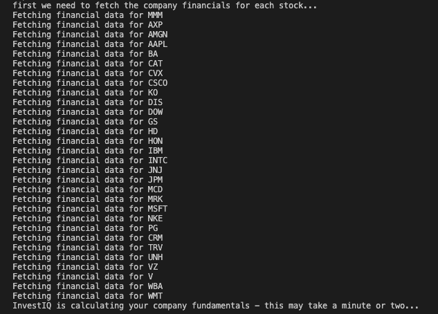
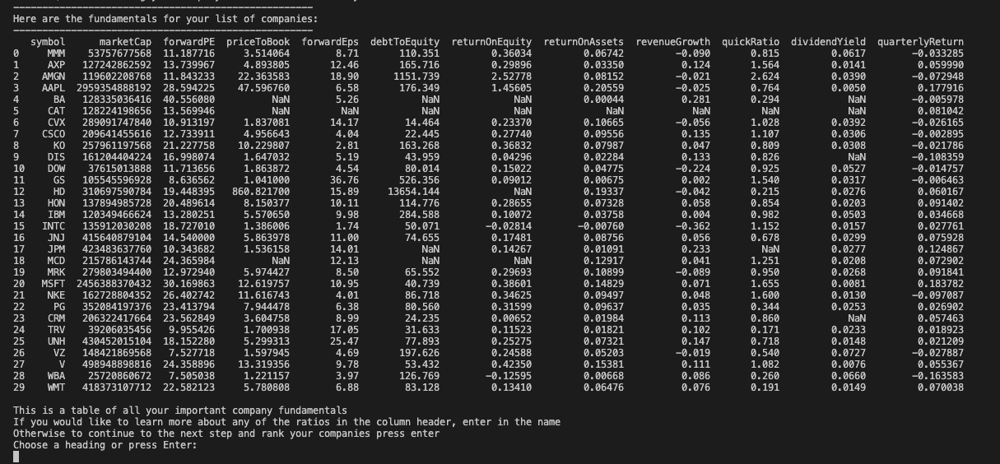
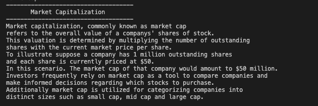
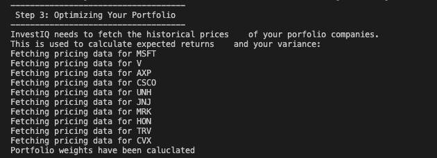
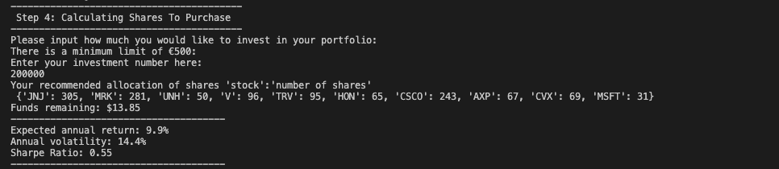
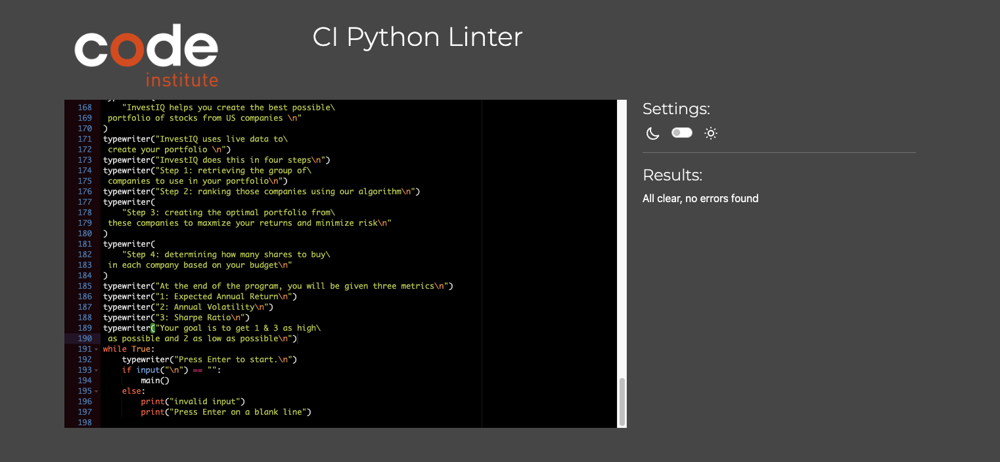

# InvestIQ

## Table of Contents

---

## Project Background

InvestIQ is a Python command line application built to assist users in creating an optimal stock portfolio from US publically listed companies. Programs exist to help people optimize their stock portfolio in order to maximize their sharpe ratio - i.e. their return relative to their risk. However, these programs presuppose that users already know which stocks they should consider. Only after the user has added their stocks do the programs work to optimize how much should be allocated towards each stock. Some programs exist to help people assess which stocks to consider using tecnhical analysis - examining past pricing data. However these are separate from the programs that optimize the portfolios. There is a gap in helping people to choose which companies to include in your porfolio by using fundamental analysis - analysis using company financial reports instead of past pricing data. There is a further gap to combine this approach with portfolio optimization to make sure the user picks the best stocks and then optimizes them in the one place.

Invest IQ uses an algorithm to rank stocks from the Dow Jones using fundamental analysis, and create an optimized portfolio from those stocks to give users the highest return for a given level of risk. By harnessing the capabilities of Python, InvestIQ can perform thousands of calculations within a matter of minutes to provide users with their stock portfolios - significantly decreasing the amount of time and effort required on their part.

Users can select which stock index they want to analyze stocks from - rank those stocks based on their fundamental ratios, choose how many stocks they want to include in their portfolio and automatically optimize their investment allocation towards each stock to get the highest expected returns for the lowest level of risk using Hierarchical Risk Parity Optimization(HRP).

InvestIQ makes creating your stock portfolio effortless.

---

## Features

- On initialisation, InvestIQ explains to users the intent of the program before encouraging them to proceed through the program by pressing enter.

    

    
InvestIQ intro

    
    

- Index chooser: InvestIQ prompts the user to decide which stock index (Dow Jones, S&P100 & S&P500) the user would like to pick stocks from. Each index contains a different number of stocks, which impacts the time required to fetch financial data from each stock and analyze their fundamentals. 

    

    
Index Chooser

    
    

- Data Scraper: InvestIQ fetches the financial information from each company in the index using yfinance. 
- NOTE: yfinance recently changed their library as this project was being submitted. As a result, rate limits have decreased significantly. The program will revert to dow jones data if the rate limit is reached. 

    

    
Data Scraper

    
    

- Stock Ranker: InvestIQ fetches financial data from each company in the index and displays it as a dataFrame to the user.

    

    
Stock Ranker 1

    
    

- Stock Ranker contd.: The financial ratios are then converted into percentiles based on their standing relative to the other stocks in the index. These percentiles are passed into an algorithm that calculates a 'score' for each stock and sorts the stocks in the dataFrame based on their score. The user is given the raw fundamentals data, percentiles data and score allocated towards each stock. The user is then prompted to decide how many stocks they would like to include in their portfolio, and the highest ranking stocks within that range are then used for further analysis. 

    

    
Stock Ranker 2

    
    

- Stock 'scores' are determined by the sum of the following ratios with the weights attached. 
    

- Ratio explainer: The program provides the user with the option to type in any fundamentals ratio and receive a description of that ratio for their own analysis. 

    

    
Ratio Explainer

    
    

- Portfolio Optimizer: The program takes the number of stocks the user has selected and calculates the optimial weights to be assigned towards each stock in the portfolio to produce the greatest returns at a given level of risk using Hierarchical Risk Parity Optimization(HRP). 

    

    
Portfolio Optimizer

    
    

- Investment Allocator: After calculating the optimal portfolio weights, the program prompts the user to input how much they intend to invest in stocks and returns to them to number of shares they should buy in each company, in addition to their expected returns, annual volatility and Sharpe Ratio (a measure of expected returns relative to risk). 

    

    
Investment Allocator

    
    

---

## Roadmap

- Incorporate Regression Analysis: 
    The weights applied to each fundamental ratio were somewhat arbitratily applied based on some limited research from finance courses in college. Future versions of this software could implement regression analysis to determine how company fundamentals predict future stock prices and apply more rigorous weights to each fundamental ratio. 

- Optionality on portfolio optimization methods: 
    This program uses a relatively conservative method (Hierarchical Risk Parity Optimization) to allocate funds towards each stock. Future iterations of this program could give users the added optionality to decide between other optimization approachs e.g. mean-variance optimization. 

- Incorporating Technical Analysis:
    Future iterations of this program could implement techncial indicators into the score generated by the algorithm to provide a more robust ranking of stocks. 

- Incorporating other financial APIs: 
    yfinance stopped working on my program and prevented me accessing financial data which stopped it working the day before this project was due to be submitted. As a result, I had to discard a lot of functions that were pulling fundamentals data from yfinance. In future, I would like to incorporate an API like polygon.io that is well maintained to retrieve dependable information. 

---

## Testing

### Testing Phase

#### Manual Testing

| Test | Result |
|--|--|
|On run programme the introductory message appears|Pass|
|After welcome message user prompted to continue by pressing Enter|Pass|
|Pressing Enter progresses the user to Step 1|Pass|
|Step 1 appears with information on constructing the index|Pass|
|After step 1 welcome message the user is prompted to enter 'y' or 'Y'|Pass|
|'y' is accepted as a valid answer|Pass|
|'Y' is accepted as a valid answer|Pass|
|Fundamentals dataFrame is presented to the user|Pass|
|Information options are presented to the user after dataFrame|Pass|
|Entering 1 presents Market Capitalization|Pass|
|Entering 2 presents Forward Price To Earnings|Pass|
|Entering 3 presents  Price to Book |Pass|
|Entering 4 presents Forward EPS |Pass|
|Entering 5 presents Debt to Equity|Pass|
|Entering 6 presents Return on Equity|Pass|
|Entering 7 presents Return on Assets|Pass|
|Entering 8 presents Revenue Growth |Pass|
|Entering 9 presents Quick Ratio |Pass|
|Entering 10 presents Dividend Yield |Pass|
|Entering 11 presents Quarterly Return |Pass|
|Pressing Enter progresses to Step 2|Pass|
|Fundamentals dataFrame is presented ranked with percentiles|Pass|
|Stocks are allocated a score|Pass|
|Forward PE and Debt to Equity are reversed - lower is better|Pass|
|Stocks with nan values are removed|Pass|
|Entering a portfolio size on Step 2 Progresses to the next step|Pass|
|Step 3 is printed|Pass|
|Company prices are fetched with a 1 second delay|Pass|
|Step 4 is printed|Pass|
|User is prompted to enter an investment amount|Pass|
|Investment number is accepted|Pass|
|Stock portfolio is printed|Pass|
|Expected Return, Annual Volatility and Share Ratio is printed|Pass|
|User is prompted to start the game again|Pass|
|Entering 1 prints Expected Annual Return description|Pass|
|Entering 2 prints Annual Volatility description|Pass|
|Entering 3 prints Sharpe Ratio description|Pass|
|Entering a blank Enter starts the game again|Pass|

#### User tests

The following tests are on the error handling throughout the project.
If the error handling works as expected it will be marked as pass.
If it does not work as expected then it will be marked as a fail.

> Press Enter to Start
Error Msg: invalid input, Press Enter on a blank line.

| Test | Result |
|--|--|
|User enters a number | Pass|
|User enters a letter|Pass|
|User enters a word|Pass|
|User enters a blank space|Pass|

> Step 1 - Enter 'y' or 'Y' to continue
Error Msg: invalid input, Press Enter on a blank line.

| Test | Result |
|--|--|
|User enters a number | Pass|
|User enters a letter|Pass|
|User enters a word|Pass|
|User enters a blank space|Pass|

> Fundamentals Information options - Choose a heading or press Enter:
Error Msg: Invalid input, try again:
        Make sure there are no spaces after your number

| Test | Result |
|--|--|
|User tried to enter a number other than 1 - 11 | Pass|
|User tried to enter a letter |Pass|
|User tried to enter an empty selection|Pass|
|User tried to enter a special symbol|Pass|
|User tried to enter a number with a space|Fail|

I did not anticipate the user entering a number with a space afterwards. I adjusted the error message to account for this. 

> Choosing your portfolio size
Error Msg: You have not chosen a valid portfolio size, please try again.
Only number values between 3 and the dataframe size are accepted

| Test | Result |
|--|--|
|User tried to enter a number less than 3| Pass|
|User tried to enter a number greater than dataframe size|Pass|
|User tried to enter an empty selection|Pass|
|User tried to enter a special symbol|Pass|
|User tried to enter a letter / word|Pass|

> Choosing investment amount - Enter your investment number here
Error Msg: Invalid input. Please enter a number - You input must be between 1000 and 9999999.

| Test | Result |
|--|--|
|User tried to enter a letter| Pass|
|User tried to enter a blank space|Pass|
|User tried to enter a number below 1000|Pass|
|User tried to enter a number above 9999999|Pass|

> Press Enter to start InvestIQ again, or type 1 to learn about expected annual return, 2 to learn about annual volatility and 3 to learn about the sharpe ratio!
Error Msg: invalid input, try again.

| Test | Result |
|--|--|
|User tried to enter a letter| Pass|
|User tried to enter a blank space|Pass|
|User tried to enter a special symbol|Pass|

### Pep8 Checker - CI Python Linter

> I used the CI Python Linter to check my python code:

All python files passed with no errros found

---

## Deployment

- Deployment for this project was straightforward enough due to the fact that I did not have any need for a config file
- Navigate to heroku.com & log in.
- Select the option to create a new app on the dashboard
- Name the application 'InvestIq' select the EU as your region and proceed to "Create app".
- On the next page click on the Settings tab to adjust the settings.
- First we need to open 'config vars' and add a key of 'port' with a value of '8000'. Then click the 'add' button.
- To run the program you need to install Buildpacks. 
- The python buildpack is installed first by selecting 'Buildpacks' in the settings tab and selecting 'python'
- node.js is also needed to run the program - this is done by selecting 'node.js' within buildpacks also
- These install future dependancies that we need outside of the requirements file.
- Python needs to be positioned above node.js - make sure that python is first.
- The ordering is as follows:
1. `heroku/python`
2. `heroku/nodejs`
- We then click on the 'deloyment' tab to select our deployment method.
- This project was connected with github with the resepective repository.
- I searched for my 'InvestIQ' repository and clicked 'connect'. 
- Next you select 'automatic deploy' as we want the program to be rebuilt every time we push to github for testing. 
- For this option choose the branch to deploy and click enable automatic deploys.
- Click on the 'deploy branch' button
- Your app is now built and ready to be used
- To find your app, navigate to the 'open app' button at the top right of the dashboard and click the button

---

## Technologies Used

- The application was developed with [Python](https://www.python.org/).
- Financial data was scraped from [Yahoo Finance](https://finance.yahoo.com/) using the yfinance library.
- [Heroku](https://www.heroku.com/platform) was used for deployment.
- [VS Code](https://code.visualstudio.com/) was used for development with the following extensions:
    - [Black](https://github.com/psf/black) was used to format my code to adhere to correct standards.
    - [Codespaces](https://github.com/features/codespaces) was used to push my commits to my repository.
- [Lucidchart](https://lucid.app) was used to generate flowcharts for the application.

## Libraries & Modules
- The [yfinance](https://pypi.org/project/yfinance/) library was used for fetching financial information from individual stocks
- The [Pandas](https://pandas.pydata.org/) library was used for processing the infromation fetched using yfinance.
- [Pandas Datareader](https://pypi.org/project/pandas-datareader/) was used to read data from webpages. 
- [PyPortfolioOpt](https://pypi.org/project/pyportfolioopt/) is a library that implements portfolio optimization methods.
- [Datetime](https://pypi.org/project/DateTime/) is used to put parameters on date ranges for fetching company statistics.

---

## Bugs

### Fixed: 

yfinance imposed limits on information that could be fetched on the day before submission. This resulted in my code throwing errors due to 'Unauthorized Access' if a limit was reached and halting the program. As a result, I had to generate a csv version of my fundamentals data for the Dow Jones that the program could fall back to if it could not fetch financials information. 

Using the yfinance api caused some problems as there was a lot of nan or missing values in the fundamentals I was looking for. To handle this and prevent errors, I removed any companies that had nan values in their fundamentals.  

### Not fixed: 

None

---

## References 
- [QuantDare's articule](https://quantdare.com/correlation-prices-returns/) was used to determine whether to calculate correlation on returns or prices between equities.
- [codeCademy](www.codecademy.com) course Python for Finance was used to assist in scraping financial data and creating foundational functions such as variance, standard deviation and correlation coefficient
- [Investopedia's](https://www.investopedia.com/financial-edge/0910/6-basic-financial-ratios-and-what-they-tell-you.aspx#:~:text=Key%20Takeaways&text=There%20are%20six%20basic%20ratios,return%20on%20equity%20(ROE).) article on financial ratios was used to determine which ratios I need to evaluate my stocks
- Information on how to gather stock information using yfinance was gathered from [Algovibes](https://www.youtube.com/watch?v=ZUQEd22oNek) Youtube video.
- Inspiration on how to rank stocks was taken from [B/O Trading Blog's Article](https://medium.com/@chris_42047/a-weighted-ranking-system-for-stocks-python-tutorial-6af425ff65a4) where an example approach to scoring and applying weights to stocks was taken. 
- Portfolio optimization methods were taken from [Sadrach Pierre's Artile](https://builtin.com/data-science/portfolio-optimization-python) on how to Optimize a stock portfolio using Python. 
- Monopoly art from [emojicombos.com](https://emojicombos.com/monopoly-ascii-art).
- Chat gpt generated the descriptions for each fundamental financial metric in the program.
- [Python Style Guide](https://peps.python.org/pep-0008/#comments) was used for determining how to style my comments.
- [CI Python Linter](https://pep8ci.herokuapp.com/) was used to check my python code agains pep8 standards. 

---

## Acknowledgements

### Lauren Nicole Poppich
- My mentor in the CI who was always on hand to provide me great feedback and calm me down when the yfinance library stopped working for me the day before submission. 

## My Code Institute Cohort
- My cohort group were always on hand to provide feedback and my cohort leader Alan Bushnell was great at brainstorming options with me the day before submission to handle yfinance not working. 